# JONNY5 — VR-Teleoperated 6-DoF Robot Arm

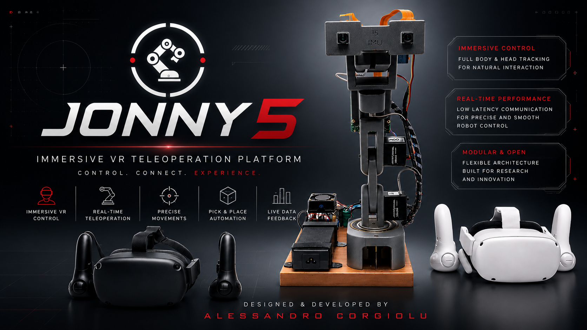

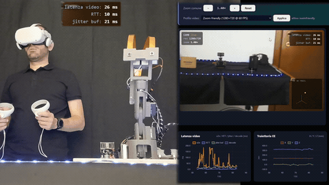

*▶ Real-time VR tele-inspection — head pose steers the wrist, hand controllers drive the arm, and the end-effector stereo feed streams back to the headset (on-screen video-latency / RTT overlay).*

**🎥 Watch the demo on YouTube:** https://youtu.be/Z4k5WhVlsj8

**🤖 ROS 2 migration:** see [jonny5_ROS2_VR](https://github.com/corgiolu-labs/jonny5_ROS2_VR) — a ROS 2 layer (custom messages, URDF model, hardware-bridge and VR-teleop nodes) built around the proven real-time core of this repository.

Low-latency, immersive teleoperation platform for a 6-DoF robot arm, built on
**open web standards** (WebXR + WebRTC) and consumer hardware. An operator
wearing a VR headset controls the arm with their own head/hand pose and receives
low-latency stereo video feedback from cameras mounted on the end-effector.

This repository contains everything needed to **build and deploy** the system:
STM32 firmware, Raspberry Pi control-plane, browser dashboard and VR viewer.

## Architecture (3 tiers)

```
                    ┌───────────────────────────────┐
                    │  VR Headset (Quest) / Browser  │
                    │   WebXR pose · WebRTC video     │
                    └──────────────┬────────────────┘
                                   │ WebSocket (wss://…:8557)
                                   │ HTTPS (…:8443)
                    ┌──────────────▼────────────────┐
                    │   Raspberry Pi 5 (middleware)  │
                    │   WS server · IK/FK solver     │
                    │   video encoding · SPI master  │
                    └──────────────┬────────────────┘
                                   │ SPI @ 100 Hz (J5VR frames)
                    ┌──────────────▼────────────────┐
                    │   STM32 Nucleo-F446RE (Zephyr) │
                    │   real-time actuation loop     │
                    │   servo PWM · IMU BNO085        │
                    │   safety gating (deadman/WDT)  │
                    └───────────────────────────────┘
```

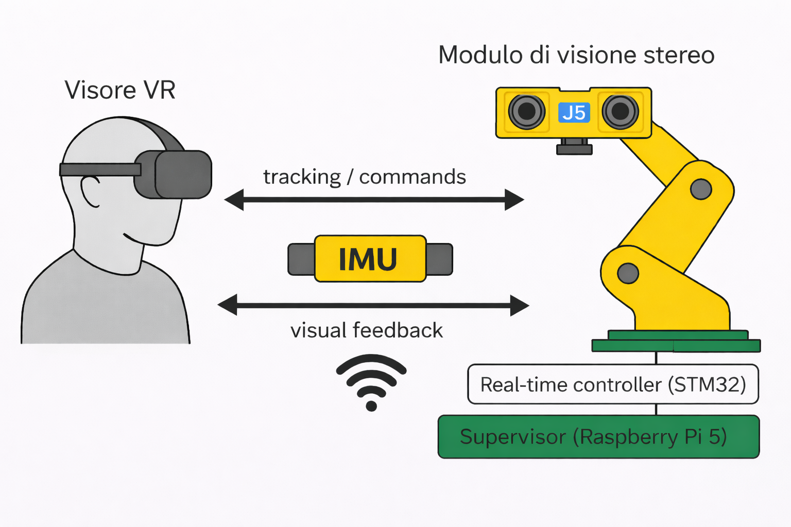

## Hardware

The arm is a 6-DoF design — **BASE / SHOULDER / ELBOW** plus a 3-axis wrist
(**YAW / PITCH / ROLL**) — actuated through the STM32 Nucleo-F446RE, supervised
by a Raspberry Pi 5, with a **BNO085 IMU** on the end-effector and two CSI
cameras providing the stereo video feed.

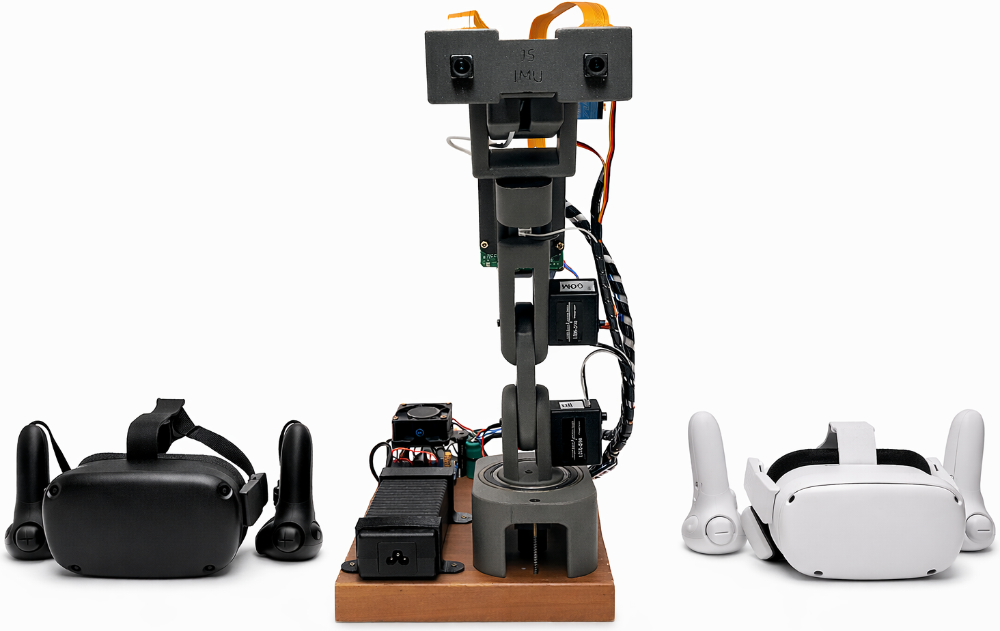


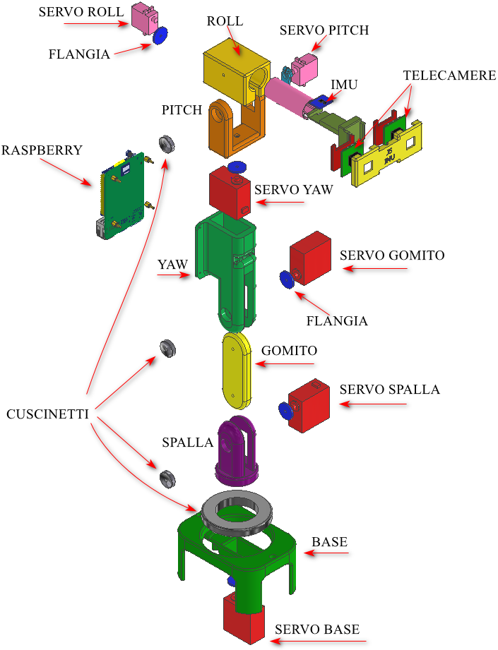

**Electrical wiring** — Raspberry Pi 5, STM32, the BNO085 IMU, the two cameras
and the six servo actuators:

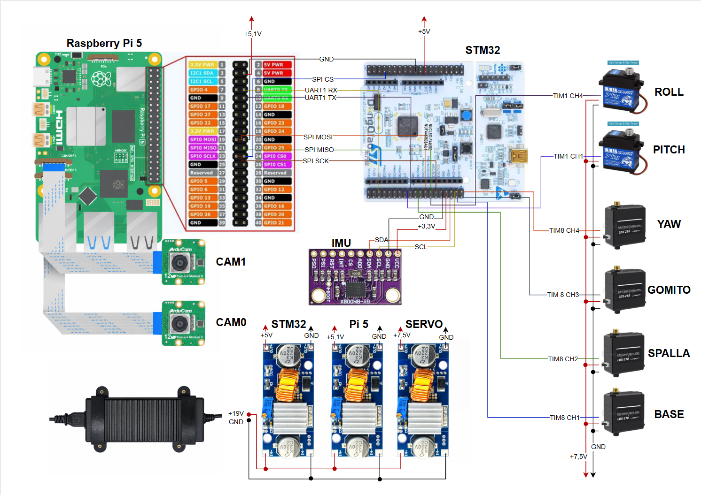

**Key components:**

|  |  |  |
|---|---|---|
| **Raspberry Pi 5**<br>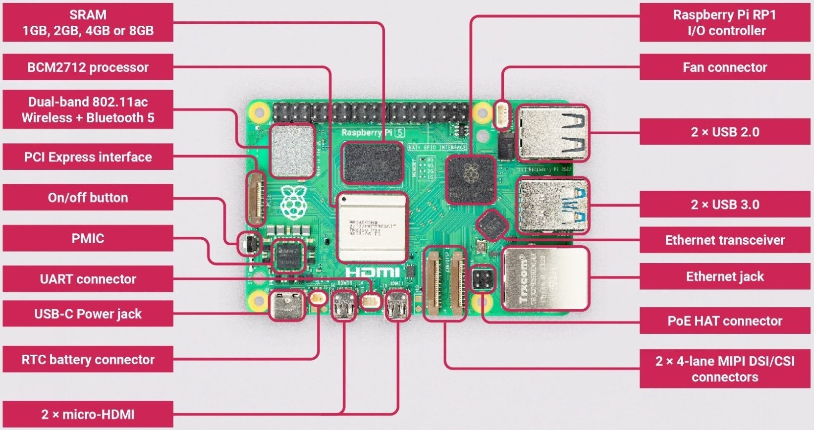 | **STM32 Nucleo-F446RE**<br>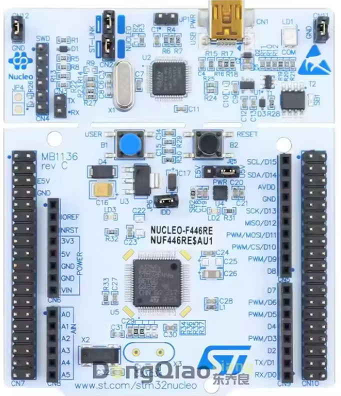 | **BNO085 IMU**<br>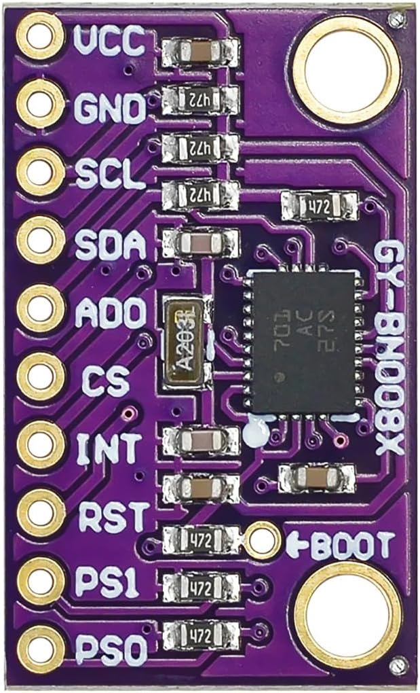 |
| **Sony IMX708 camera** (×2)<br>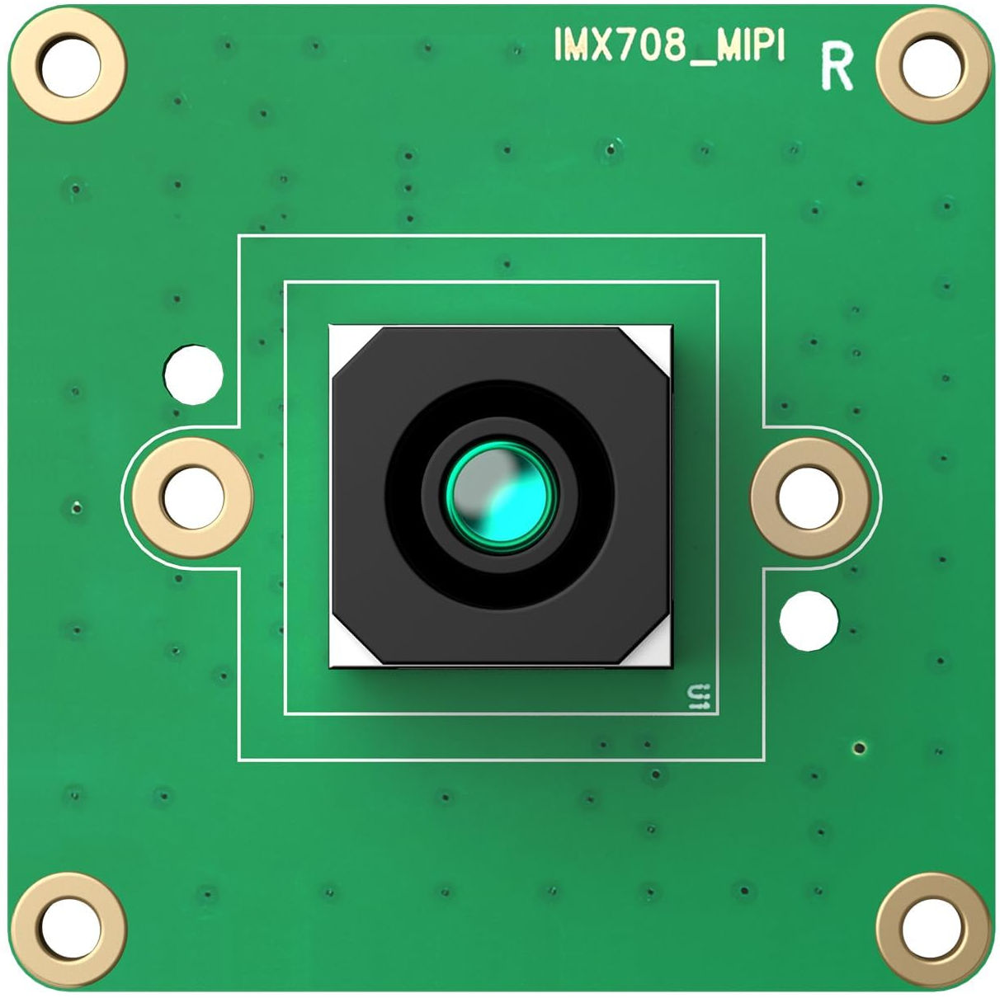 | **Servo LDX-218**<br>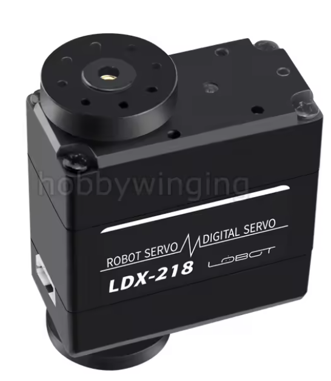 | **Servo INJORA INJS2065**<br>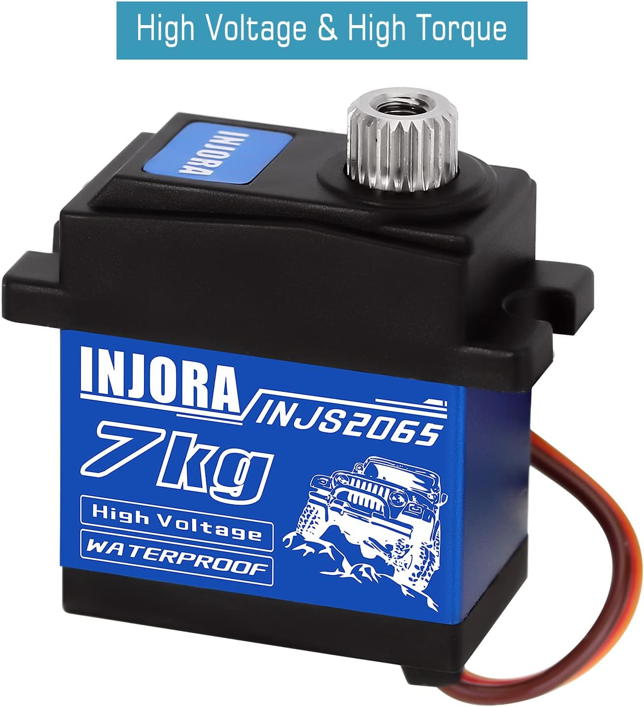 |
| **XL4015 step-down**<br>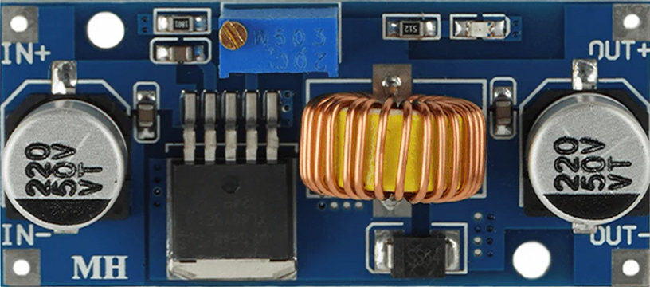 |  |  |

## Directory layout

| Path | Contents |
|---|---|
| `firmware/stm32/` | Zephyr firmware for STM32 Nucleo-F446RE: real-time loop, servo PWM, IMU (BNO085), SPI slave, safety gating |
| `raspberry/controller/` | Python control-plane: WebSocket handlers, IK/FK solver (PoE model), head-assist logic, SPI bridge, settings manager; ASSIST/IMU/IK validation suite under `controller/audit/` |
| `raspberry/config_runtime/` | Runtime configuration (joint offsets/limits, PoE params, IMU calibration, TLS placeholders) |
| `raspberry/systemd/` | systemd service units for the Pi daemons |
| `raspberry/networkmanager/` | dnsmasq captive-portal config (first-time headset setup) |
| `raspberry/tools/` | Standalone diagnostic scripts — end-to-end latency measurement and world-bias calibration |
| `web/dashboard/` | Operator dashboard (FK/IK/IMU compare, joints, settings, live Test page) |
| `web/vr/` | VR viewer (stereo WebRTC pipeline) |
| `scripts/` | Helper scripts (video pipeline, MediaMTX launcher) |
| `docs/` | Design & build docs — system overview, robot photos, exploded view, electrical schematic, component photos (`components/`) and reference diagrams (`diagrams/`) |
| `media/images/` | Rendered figures — operator dashboard (`dashboard/`), system-architecture diagram and performance/latency charts |
| `deploy.sh` / `deploy.bat` | rsync + ssh deploy to the Pi |
| `setup_pi.sh` | One-time Pi bootstrap |

## Prerequisites

**Raspberry Pi 5** (Raspberry Pi OS, 64-bit):
- `python3` + `python3-venv`, `curl` (MediaMTX is auto-downloaded by `deploy.sh`)
- 2× camera modules (Sony IMX708) on the CSI ports

**STM32 Nucleo-F446RE** firmware build host:
- [PlatformIO](https://platformio.org/) (`pip install platformio`)

**Development host** (for deploy): `ssh` and `rsync`.

## Quick start

### 1. Flash the firmware (STM32)

```bash
cd firmware/stm32
pio run -t upload        # builds the Zephyr image and flashes via ST-Link
```

### 2. Deploy the Pi control-plane

```bash
./deploy.sh jonny5@<pi-host>     # default: jonny5@10.42.0.1
```

`deploy.sh` rsyncs `raspberry/`, `web/` and `scripts/` to the Pi, creates a
Python venv from `raspberry/requirements-controller.txt`, downloads MediaMTX if
missing, generates self-signed TLS certs on first run, and installs + restarts
the systemd services.

> First-time only: run `./setup_pi.sh` on the Pi to bootstrap system packages
> and the NetworkManager hotspot/captive-portal.

### 3. Connect

- Dashboard: `https://<pi-host>/` (self-signed cert — accept the browser warning)
- VR viewer: open the dashboard from the headset browser and start the WebXR session

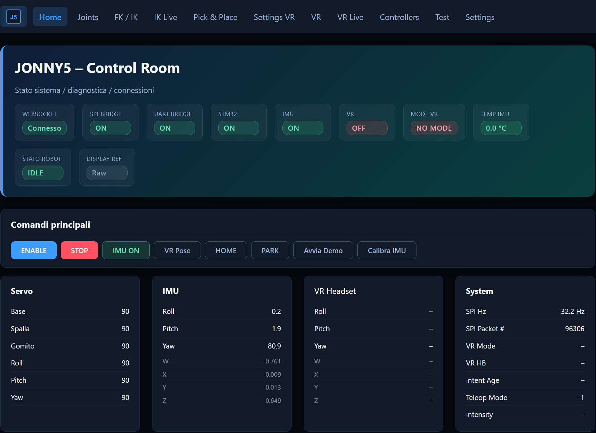

Other dashboard pages:

|  |  |
|---|---|
| **Joints**<br>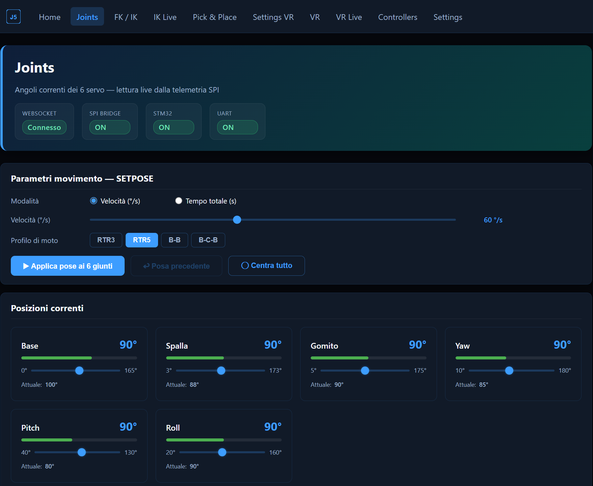 | **FK / IK compare**<br>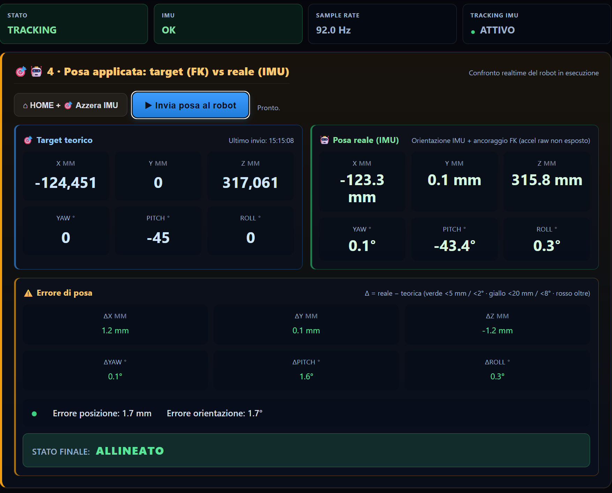 |
| **IK Live**<br>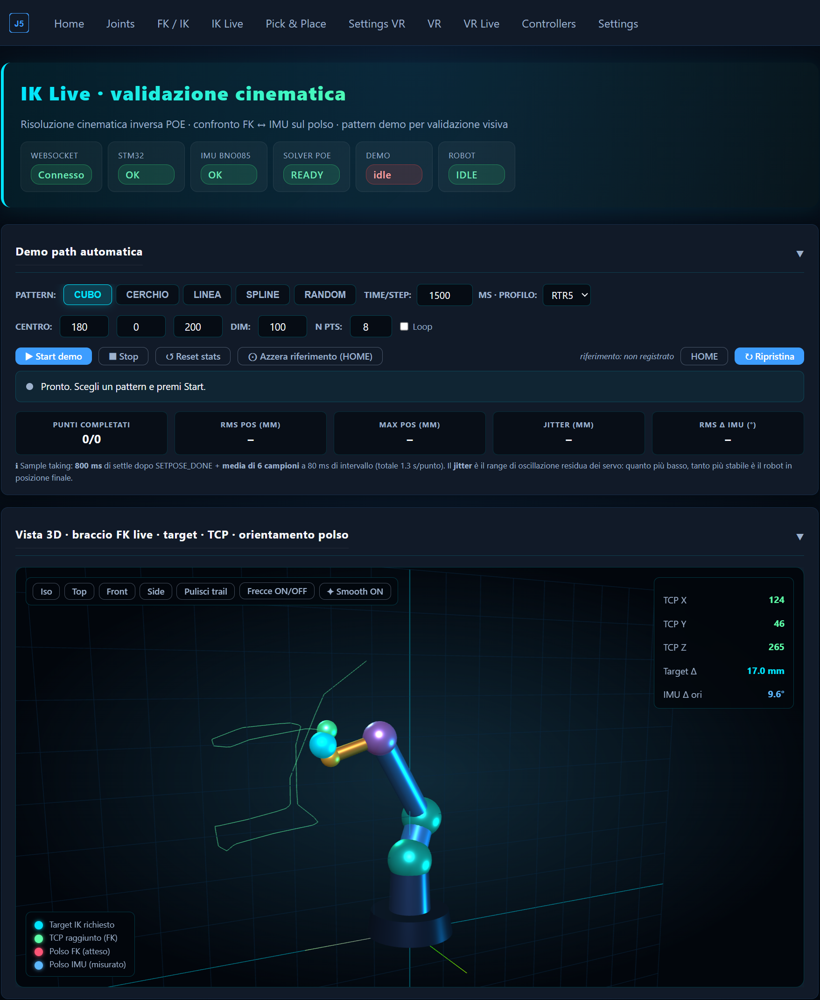 | **VR settings**<br>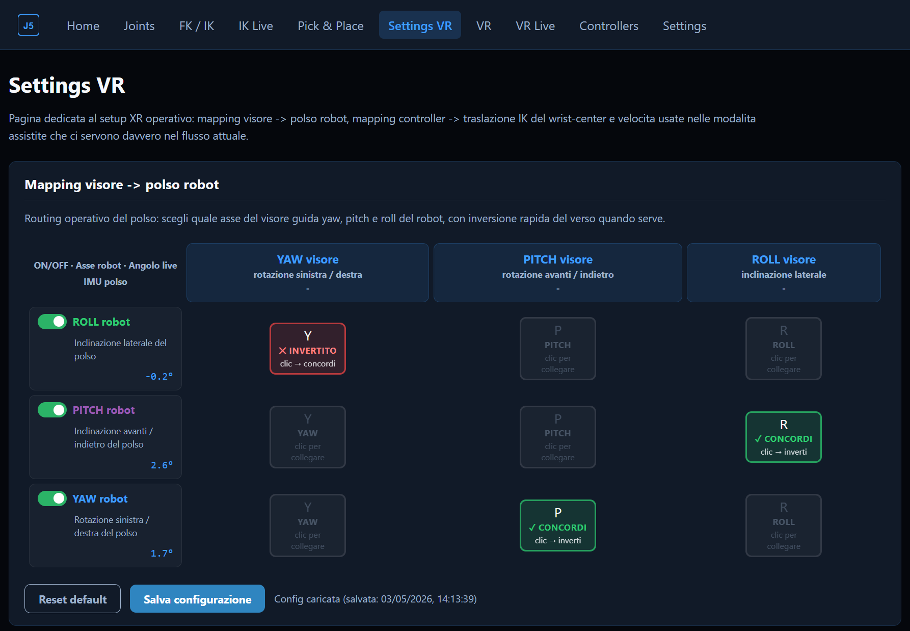 |

## Runtime services (Pi)

```
jonny5-ws-teleop       — WebSocket server @ 8557 (dispatcher, IK/FK, head-assist)
jonny5-spi-j5vr        — SPI master (Pi → STM32), 100 Hz J5VR frames
jonny5-https           — static files + dashboard over HTTPS @ 8443
jonny5-https-443-proxy — 443 → 8443 forwarder (headset browser compatibility)
jonny5-captive-portal  — captive portal for first-time headset setup
jonny5-mediamtx        — WebRTC media server for stereo video
```

Live logs:

```bash
ssh jonny5@<pi-host> 'journalctl -fu jonny5-ws-teleop'
```

## Key subsystems

### Kinematics
Product of Exponentials (PoE) forward/inverse kinematics;
`raspberry/controller/.../ik_solver.py`, PoE params in `config_runtime/kinematics/`.

|  |  |
|---|---|
| 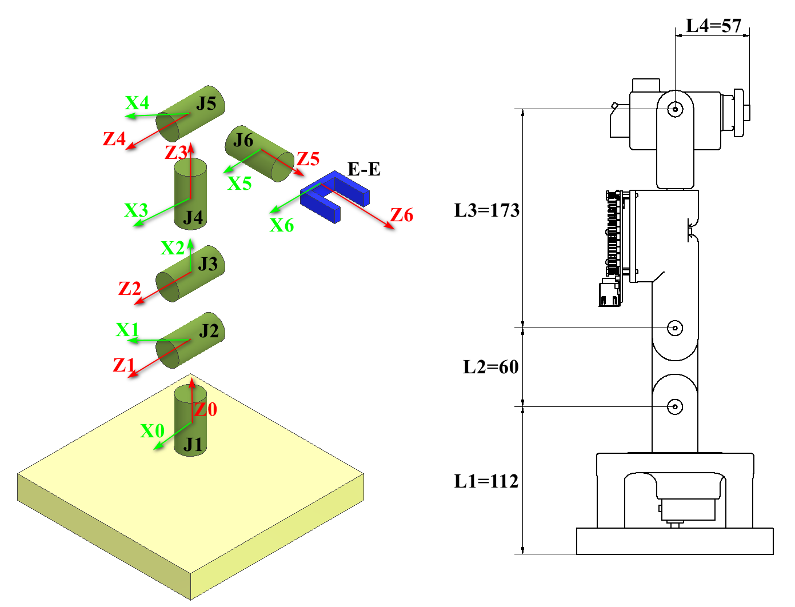 | 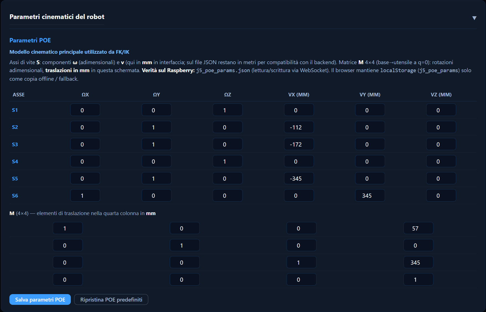 |

### IMU pipeline
BNO085 (Rotation Vector @ ~100 Hz) with a frame-alignment chain that maps the raw
IMU orientation into the robot end-effector frame:

```text
R_ee = R_home⁻¹ · R_world_bias⁻¹ · R_imu · R_mount⁻¹
```

where `R_mount` is the mechanical chip→end-effector rotation
(`config_runtime/imu/imu_ee_mount.json`), `R_world_bias` the magnetometer-derived
world reference and `R_home` the operator-captured "zero at HOME" offset. The same
chain is exercised by the audit suite (`controller/audit/verify_imu_alignment.py`,
`verify_zero_at_home.py`).

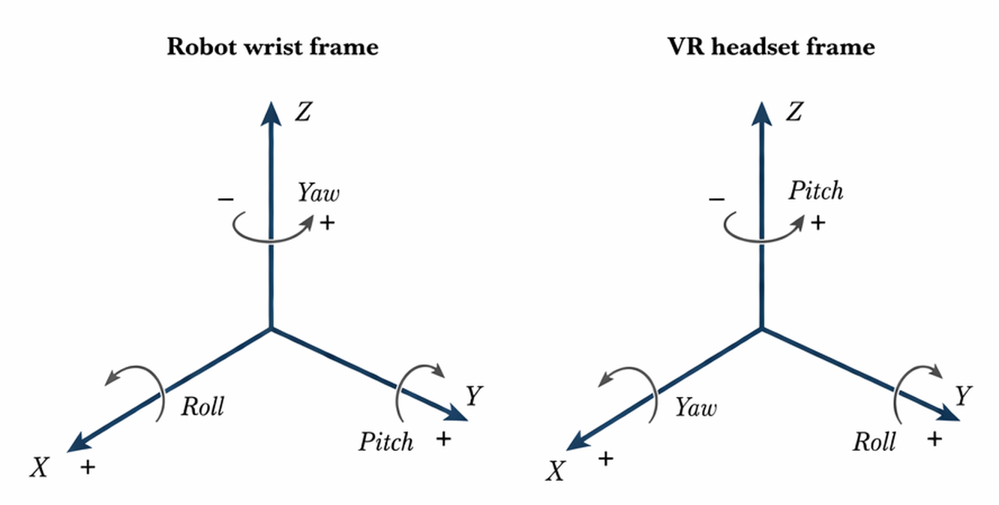

### Video
MediaMTX (WebRTC/WHEP, H.264 hardware encode); low-latency profile 800×450 @ 120 fps.

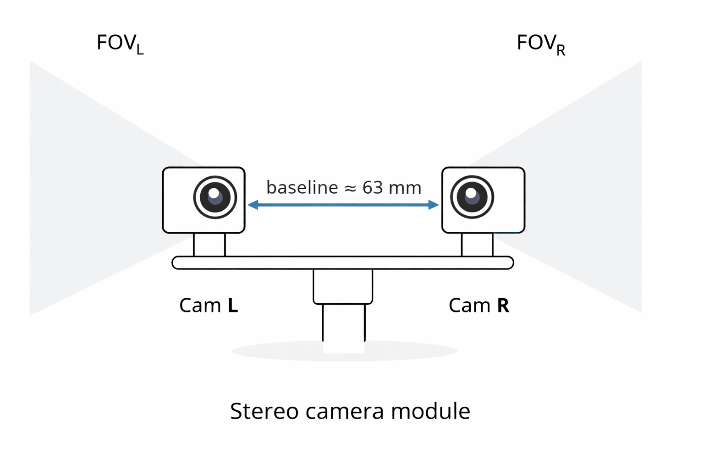

### Real-time firmware loop
The STM32 runs a deterministic **1 kHz** control loop
(`firmware/stm32/src/core/rt_loop.c`), clocked by a hardware timer (TIM6) for
jitter-free 1 ms ticks; the BNO085 IMU is sampled on a dedicated 400 Hz thread.

### SPI data-plane (J5VR protocol)
The Raspberry Pi (master) streams fixed **64-byte J5VR frames** to the STM32
(slave) at 100 Hz (`firmware/stm32/src/spi/j5_protocol.h`,
`raspberry/controller/spi_dataplane/j5vr_frame.py`). Each frame carries a
`'J' '5'` header, a protocol-version byte, a monotonic big-endian sequence counter
and a 54-byte payload. The payload `mode` byte selects the teleop mode
(0 = CALIB … 5 = ASSIST); in **ASSIST** mode an extension (marker `'I'` at byte 36)
carries the BASE / SHOULDER / ELBOW arm targets as big-endian `int16` centi-degrees.

### Safety
Firmware-side deadman + heartbeat watchdog (100 ms) and servo limits,
independent of the general-purpose Pi node.

## Performance

End-to-end latency was characterised across the video-pipeline profiles. The
adopted low-latency VR profile (800×450 @ 120 fps, WebRTC/H.264) reaches an
estimated **~38 ms** glass-to-glass — about half the MJPEG full-stack latency at
the same profile (≈ 38 ms vs ≈ 76 ms) — and well under the ~100 ms VR perceptual
threshold.

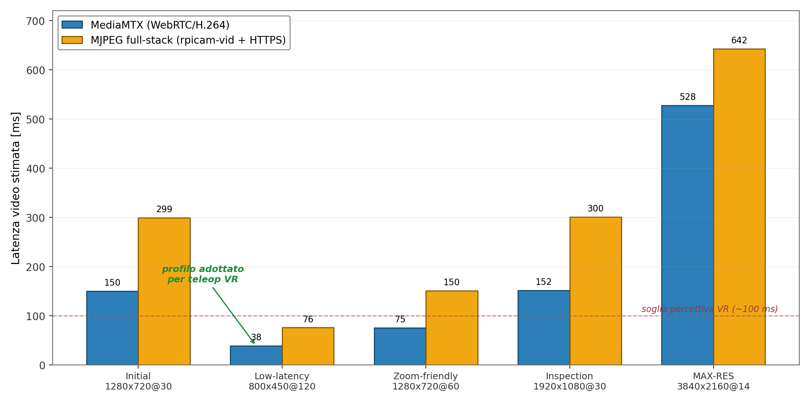

The command path adds only ≈ 2.7 ms round-trip; operator-perceived latency is
≈ 62 ms in-headset, dominated by the video path.

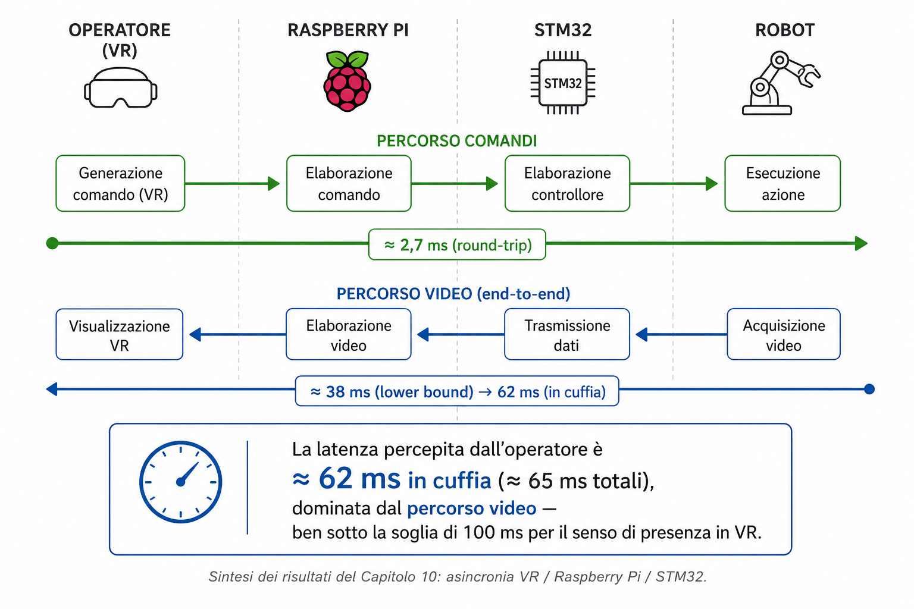

## AI-Augmented Development

JONNY5 was developed with AI coding agents as a first-class part of the workflow.
I used and tested three of them — **Claude Code** (Anthropic), **OpenAI Codex**
and **Cursor** — across the project: firmware (the 1 kHz real-time loop, BNO085
IMU driver, SPI J5VR protocol, safety gating), the PoE inverse-kinematics
control-plane, system integration, debugging, and the validation/audit tooling.

The division of labour is deliberate and human-in-the-loop: I own the
architecture, the real-time and hardware design decisions, and all on-hardware
validation; the agents accelerate implementation, debugging, tooling and data
analysis. Nothing reaches the robot without my explicit sign-off — every commit
in this repository carries a `Co-Authored-By` AI trailer, and the agents never
act on hardware autonomously.

## Code entry points

- Control-plane: `raspberry/controller/web_services/ws_server.py`
- Firmware real-time loop: `firmware/stm32/src/core/rt_loop.c`
- Authoritative runtime config: `raspberry/config_runtime/robot/routing_config.json`

## License

Released under the [MIT License](LICENSE) — © 2026 Alessandro Corgiolu.

---

Developed by **Alessandro Corgiolu** as part of an MSc thesis in Management
Engineering, Università Telematica Internazionale UNINETTUNO.
